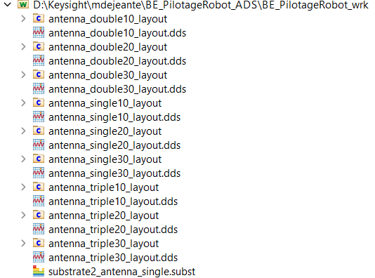
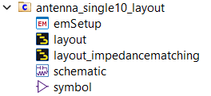

# BE_PilotageRobot_ADS #

## Objectifs ##
Permettre à des chercheurs de l'ISEN d'avoir un dispositif permettant la mesure de champs EM dans le cadre d'études NFC ainsi qu'une représentation et augmentation des données collectées via algorithmes.  

### Equipe SONDE ###
**Utilisation et pilotage d'un robot permettant la mesure du champ Electromagnétique généré lors d'un contact NFC.**
  
Notre étude se base sur la conception de différentes antennes via le logiciel ADS. Au travers de layout, nous avons réalisé des antennes de 1,2 et 3cm² avec chacune 1,2 ou 3 spires.   

Ce projet réalisé avec ADS comporte tous les designs d'antennes ayant été réalisés.  

  

  
Egalement, pour d'éventuels circuits comprenant une partie consommatrice de puissance, un circuit d'adaptation d'impédance à été pensé.
  
Les composants adaptés sont à apposer dans les layouts "impedance matching".

  

